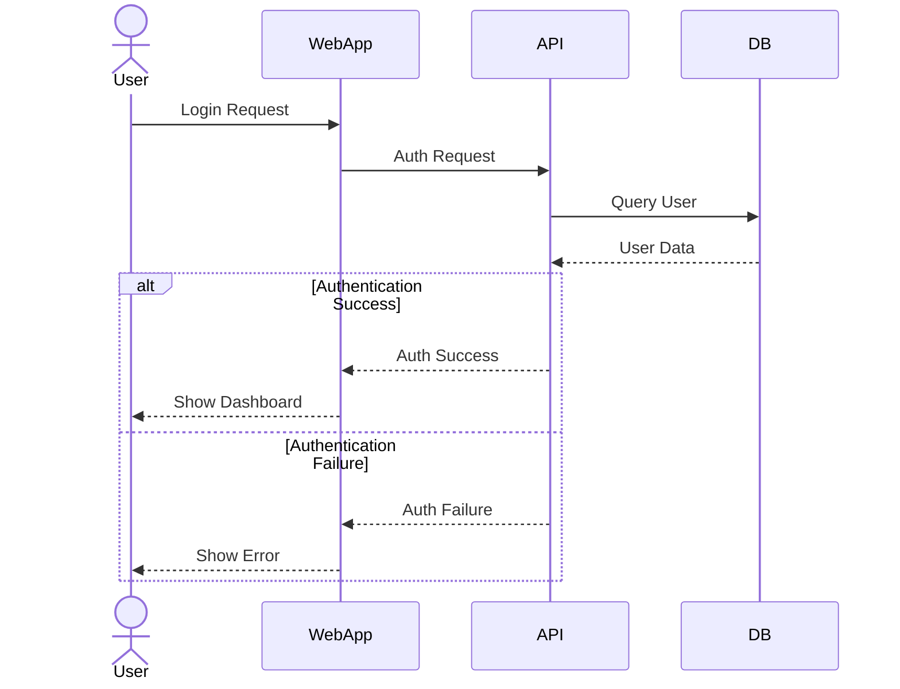

# PlantUML CookBook: 実践的な業務活用ガイド

## はじめに

「図は千の言葉に勝る」といわれます。私たちソフトウェア開発の現場では、正確かつ効率的なコミュニケーションが成功の鍵です。PlantUMLは、シンプルなテキスト記述から多様なUML図を自動生成できるツールで、ドキュメント作成の負担を大幅に軽減し、チーム内の認識共有を促進します。

本書は、PlantUMLを業務で活用したい方に向けて、「いつ」「どのように」「どの図を」使うべきかを実践的に解説します。基本的な使い方から応用テクニックまで、実際の業務シナリオに基づいたレシピを多数収録しています。

## 目次

1. [PlantUMLの基本と環境構築](#1-plantumlの基本と環境構築)
2. [要件定義フェーズでの活用](#2-要件定義フェーズでの活用)
3. [設計フェーズでの活用](#3-設計フェーズでの活用)
4. [実装フェーズでの活用](#4-実装フェーズでの活用)
5. [テストフェーズでの活用](#5-テストフェーズでの活用)
6. [運用・保守フェーズでの活用](#6-運用保守フェーズでの活用)
7. [チームコミュニケーションでの活用](#7-チームコミュニケーションでの活用)
8. [マネジメント視点での活用](#8-マネジメント視点での活用)
9. [ドキュメント管理と自動化](#9-ドキュメント管理と自動化)
10. [高度な活用テクニック](#10-高度な活用テクニック)

## 1. PlantUMLの基本と環境構築

### 1.1 PlantUMLとは何か？

PlantUMLはテキストベースのUMLモデリングツールです。テキストで記述された構文から、自動的に図を生成する特徴があります。最大の利点は以下の通りです：

- バージョン管理システム（Git等）と親和性が高い
- テキストエディタやIDEと統合可能
- 作図の時間を短縮できる
- 一貫性のある図を簡単に作成・更新できる

### 1.2 なぜPlantUMLを使うべきか？

**レシピ：従来の図ツールとPlantUMLの比較**

**課題**：チームでの図の作成・更新・共有が効率的でない

**解決策**：PlantUMLを導入して、テキストベースで図を管理する

| 従来のドローイングツール | PlantUML |
|----------------------|----------|
| 編集には専用ツールが必要 | テキストエディタで編集可能 |
| バージョン管理が困難 | Gitなどで差分管理が容易 |
| 図の一貫性を保つのが難しい | スタイルを統一しやすい |
| コピー&ペーストで図の要素を再利用 | マクロや共通定義で再利用性が高い |
| 図の更新に時間がかかる | テキストを修正するだけで自動更新 |

### 1.3 環境構築の基本

**レシピ：開発者のための基本環境構築**

**課題**：開発環境にPlantUMLを導入したい

**解決策**：

1. Java Runtime Environment (JRE) をインストール
2. Graphviz (dot) をインストール
3. PlantUMLのjarファイルをダウンロード
4. お好みのエディタ/IDEにPlantUMLプラグインをインストール

**Visual Studio Codeでの設定例**：
1. VS Code を起動
2. 拡張機能マーケットプレイスで「PlantUML」を検索しインストール
3. 設定でJavaとGraphvizのパスを指定
4. `.puml`または`.plantuml`ファイルを作成して編集開始
5. Alt + D（Windows/Linux）または Option + D（Mac）でプレビュー表示

### 1.4 最初の図を作成する

**レシピ：5分でシーケンス図を作成**

**課題**：初めてのPlantUML図を作成したい

**解決策**：以下のコードを`.puml`ファイルに保存し、プレビュー表示

```
@startuml
actor ユーザー
participant "Webブラウザ" as Browser
participant "Webサーバー" as Server
database "データベース" as DB

ユーザー -> Browser: ページにアクセス
Browser -> Server: HTTPリクエスト
Server -> DB: データ照会
DB --> Server: 結果返却
Server --> Browser: HTMLレスポンス
Browser --> ユーザー: ページ表示
@enduml
```

**ポイント**：
- `@startuml`と`@enduml`で図の範囲を定義
- 各参加者（アクター、コンポーネント）を定義
- `->` で処理の流れを記述
- `-->` で応答を記述

## 2. 要件定義フェーズでの活用

### 2.1 顧客の要件をユースケース図で可視化

**レシピ：要件定義会議の準備と実施**

**課題**：顧客と要件確認の会議があり、システムの範囲と機能を明確にしたい

**解決策**：ユースケース図を作成して、システムの利用者と機能を視覚化

```
@startuml
left to right direction
skinparam actorStyle awesome

actor "一般ユーザー" as User
actor "管理者" as Admin
actor "決済システム" as Payment

rectangle "ECサイトシステム" {
  usecase "商品を検索する" as UC1
  usecase "商品を閲覧する" as UC2
  usecase "カートに追加する" as UC3
  usecase "注文する" as UC4
  usecase "支払いを行う" as UC5
  usecase "商品を管理する" as UC6
  usecase "ユーザーを管理する" as UC7
  usecase "注文を管理する" as UC8
  
  User --> UC1
  User --> UC2
  User --> UC3
  User --> UC4
  User --> UC5
  
  Admin --> UC6
  Admin --> UC7
  Admin --> UC8
  
  UC5 --> Payment
}

note right of UC5
  外部決済サービスと
  連携して処理
end note
@enduml
```

**活用ポイント**：
- 顧客との会議前に素案を作成
- 会議中にリアルタイムで修正可能
- アクターとシステムの境界を明確に
- ユースケース間の関連性を示すことも可能
- 注記で補足情報を追加

### 2.2 ビジネスプロセスをアクティビティ図で表現

**レシピ：業務フローの可視化**

**課題**：システム化する業務の流れを関係者間で共有したい

**解決策**：アクティビティ図で業務プロセスを表現

```
@startuml
|お客様|
start
:商品を選択;
:カートに追加;
repeat
  :他の商品を探す;
repeat while (買い物を続ける?) is (はい)
->いいえ;
:レジに進む;

|システム|
:配送先情報の入力を要求;
:支払い方法の選択を要求;

|お客様|
:配送先情報を入力;
:支払い方法を選択;
:注文確定ボタンをクリック;

|システム|
:在庫確認;

if (在庫あり?) then (はい)
  :注文受付;
  :支払い処理;
  
  |お客様|
  :注文完了メールを受信;
  stop
else (いいえ)
  :在庫切れ通知;
  
  |お客様|
  :代替品を提案される;
  
  if (代替品を購入?) then (はい)
    :代替品をカートに追加;
    ->再注文処理へ;
  else (いいえ)
    :注文キャンセル;
    stop
  endif
endif
@enduml
```

**活用ポイント**：
- 各アクターの責任範囲をスイムレーンで区切る
- 条件分岐やループを明示
- エラーケースも含めて全体の流れを把握
- 顧客や業務担当者との認識合わせに効果的

### 2.3 要件の関連性を把握するためのマインドマップ

**レシピ：プロジェクトスコープの可視化**

**課題**：多岐にわたる要件を構造化して把握したい

**解決策**：マインドマップで要件の全体像と関連性を整理

```
@startmindmap
* ECサイトプロジェクト
** 商品管理
*** 商品マスタ登録
*** 在庫管理
*** 価格管理
*** カテゴリ管理
** 顧客管理
*** 会員登録
*** 会員情報管理
*** ポイント管理
** 注文管理
*** カート機能
*** 注文処理
*** 支払い管理
*** 配送管理
** コンテンツ管理
*** お知らせ管理
*** 特集ページ管理
*** レコメンド管理
** 分析機能
*** 売上レポート
*** 顧客分析
*** アクセス解析
@endmindmap
```

**活用ポイント**：
- 要件の全体像を階層的に整理できる
- プロジェクトの範囲を俯瞰できる
- 各機能の優先順位付けに役立つ
- 漏れや抜けを発見しやすい

## 3. 設計フェーズでの活用

### 3.1 システム構成図の作成

**レシピ：システム全体像の設計**

**課題**：新システムの構成要素と関係性を明確化したい

**解決策**：コンポーネント図でシステム構成を表現

```
@startuml
!include <c4/C4_Component.puml>

LAYOUT_WITH_LEGEND()

title ECサイトシステム構成図

Person(customer, "顧客", "ECサイト利用者")
Person(admin, "管理者", "サイト運営担当者")

System_Boundary(ec_system, "ECサイトシステム") {
  Container(web_server, "Webサーバー", "Nginx", "静的コンテンツ配信、リバースプロキシ")
  Container(app_server, "アプリケーションサーバー", "Spring Boot", "ビジネスロジック処理")
  Container(batch_server, "バッチサーバー", "Spring Batch", "定期処理実行")
  
  ContainerDb(db, "データベース", "PostgreSQL", "マスタデータ、トランザクションデータ")
  Container(cache, "キャッシュサーバー", "Redis", "セッション管理、一時データ保持")
  Container(search, "検索エンジン", "Elasticsearch", "商品検索機能提供")
}

System_Ext(payment, "決済サービス", "クレジットカード決済、電子マネー決済")
System_Ext(delivery, "配送会社システム", "配送状況管理")
System_Ext(mail, "メール配信サービス", "各種通知メール送信")

Rel(customer, web_server, "利用", "HTTPS")
Rel(admin, web_server, "管理", "HTTPS")
Rel(web_server, app_server, "リクエスト転送", "AJP")
Rel(app_server, db, "データ操作", "JDBC")
Rel(app_server, cache, "キャッシュ利用", "Redis Protocol")
Rel(app_server, search, "検索リクエスト", "REST API")
Rel(app_server, payment, "決済処理", "REST API")
Rel(app_server, delivery, "配送依頼", "SOAP")
Rel(app_server, mail, "メール送信", "SMTP")
Rel(batch_server, db, "データ処理", "JDBC")
Rel(batch_server, search, "インデックス更新", "REST API")
@enduml
```

**活用ポイント**：
- C4モデルのような標準的な表記法を活用
- システムの境界と外部システムを明示
- コンポーネント間の通信プロトコルを明記
- 図の凡例を含めて理解しやすく

### 3.2 データベース設計のためのER図

**レシピ：データモデルの設計と共有**

**課題**：データベースの構造を設計してチームで共有したい

**解決策**：ER図でテーブル間の関係性を表現

```
@startuml
!define Table(name,desc) class name as "desc" << (T,#FFAAAA) >>
!define PK(x) <b><color:#b8861b><&key></color> x</b>
!define FK(x) <color:#aaaaaa><&link-intact></color> x

' テーブル定義
Table(users, "users\nユーザー情報") {
  PK(id): INT
  email: VARCHAR
  password_hash: VARCHAR
  name: VARCHAR
  created_at: TIMESTAMP
  updated_at: TIMESTAMP
}

Table(products, "products\n商品情報") {
  PK(id): INT
  name: VARCHAR
  description: TEXT
  price: DECIMAL
  stock: INT
  category_id: INT
  created_at: TIMESTAMP
  updated_at: TIMESTAMP
}

Table(categories, "categories\nカテゴリ") {
  PK(id): INT
  name: VARCHAR
  parent_id: INT
}

Table(orders, "orders\n注文") {
  PK(id): INT
  FK(user_id): INT
  status: VARCHAR
  total_amount: DECIMAL
  payment_method: VARCHAR
  shipping_address: TEXT
  created_at: TIMESTAMP
  updated_at: TIMESTAMP
}

Table(order_items, "order_items\n注文明細") {
  PK(id): INT
  FK(order_id): INT
  FK(product_id): INT
  quantity: INT
  price: DECIMAL
}

' リレーションシップ
users "1" -- "0..*" orders
categories "1" -- "0..*" products
categories "0..1" -- "0..*" categories : parent
orders "1" -- "1..*" order_items
products "1" -- "0..*" order_items
@enduml
```

**活用ポイント**：
- 主キー、外部キーを視覚的に区別
- カラムの型情報を含める
- テーブル間の関係性（1対多、1対1など）を明示
- DBMSに依存しない汎用的な設計から作成

### 3.3 クラス設計

**レシピ：オブジェクト指向設計の可視化**

**課題**：システムのクラス構造を整理してチームと共有したい

**解決策**：クラス図でオブジェクトモデルを表現

```
@startuml
package "ドメインモデル" {
  class User {
    - id: Long
    - email: String
    - name: String
    + authenticate(): boolean
    + updateProfile(name: String): void
  }
  
  class Product {
    - id: Long
    - name: String
    - price: BigDecimal
    - stock: int
    + isInStock(): boolean
    + reduceStock(quantity: int): void
  }
  
  class Order {
    - id: Long
    - userId: Long
    - status: OrderStatus
    - items: List<OrderItem>
    - totalAmount: BigDecimal
    + calculateTotal(): BigDecimal
    + checkout(): void
    + cancel(): void
  }
  
  class OrderItem {
    - id: Long
    - productId: Long
    - quantity: int
    - price: BigDecimal
    + getSubtotal(): BigDecimal
  }
  
  enum OrderStatus {
    PENDING
    PAID
    SHIPPED
    DELIVERED
    CANCELLED
  }
  
  User "1" -- "0..*" Order
  Order "1" *-- "1..*" OrderItem
  Product "1" -- "0..*" OrderItem
  Order -- OrderStatus
}

package "サービス層" {
  class UserService {
    + register(email: String, password: String): User
    + findById(id: Long): User
    + updateUser(user: User): void
  }
  
  class ProductService {
    + getProducts(category: String): List<Product>
    + findById(id: Long): Product
    + updateStock(productId: Long, quantity: int): void
  }
  
  class OrderService {
    + createOrder(userId: Long, items: List<OrderItem>): Order
    + processPayment(orderId: Long): boolean
    + shipOrder(orderId: Long): void
  }
}

package "リポジトリ層" {
  interface UserRepository {
    + findById(id: Long): User
    + save(user: User): User
    + findByEmail(email: String): User
  }
  
  interface ProductRepository {
    + findById(id: Long): Product
    + save(product: Product): Product
    + findByCategory(category: String): List<Product>
  }
  
  interface OrderRepository {
    + findById(id: Long): Order
    + save(order: Order): Order
    + findByUserId(userId: Long): List<Order>
  }
}

UserService --> UserRepository
ProductService --> ProductRepository
OrderService --> OrderRepository
OrderService --> ProductService
@enduml
```

**活用ポイント**：
- パッケージで責務ごとにクラスを整理
- 属性とメソッドの可視性を明示（+, - など）
- 関連、集約、継承などの関係を表現
- 列挙型やインターフェースも表現可能

### 3.4 アーキテクチャ設計

**レシピ：レイヤードアーキテクチャの設計**

**課題**：システムの階層構造を設計し、各層の役割と依存関係を明確にしたい

**解決策**：パッケージ図でアーキテクチャを表現

```
@startuml
skinparam packageStyle rectangle

package "Presentation Layer" {
  [WebController]
  [ApiController]
  [Validator]
  [DTO]
}

package "Application Layer" {
  [ApplicationService]
  [Assembler]
}

package "Domain Layer" {
  [DomainModel]
  [DomainService]
  [Repository Interface]
  [Factory]
}

package "Infrastructure Layer" {
  [RepositoryImpl]
  [ExternalServiceAdapter]
  [DBAccess]
  [Logging]
}

[WebController] --> [ApplicationService]
[ApiController] --> [ApplicationService]
[ApplicationService] --> [DomainService]
[ApplicationService] --> [Repository Interface]
[DomainService] --> [DomainModel]
[RepositoryImpl] ..> [Repository Interface] : implements
[RepositoryImpl] --> [DBAccess]

note right of [DomainModel]
  ビジネスロジックの中心
  ここに最も重要なルールが
  カプセル化される
end note

note left of [ApplicationService]
  ユースケースを実装
  トランザクション境界を定義
end note
@enduml
```

**活用ポイント**：
- 各レイヤーの責務を明確に
- 依存関係の方向をコントロール（依存性逆転の原則など）
- 実装と抽象の関係を表現（点線）
- 注記でポイントを補足

## 4. 実装フェーズでの活用

### 4.1 複雑なアルゴリズムのフロー図

**レシピ：アルゴリズムの可視化**

**課題**：複雑なビジネスロジックの実装前に流れを整理したい

**解決策**：フローチャートでアルゴリズムを表現

```
@startuml
start
:注文を受け付け;

if (在庫チェック) then (在庫あり)
  :注文情報を登録;
  :支払処理を開始;
  
  if (支払い方法) then (クレジットカード)
    :カード認証処理;
    
    if (認証結果) then (成功)
      :決済完了;
    else (失敗)
      :カード情報再入力要求;
      stop
    endif
    
  else if (支払い方法) then (コンビニ決済)
    :支払い情報発行;
    :入金待ち状態に設定;
    note right: バッチ処理で入金確認
    
  else (後払い)
    :審査API呼び出し;
    
    if (審査結果) then (承認)
      :後払い設定;
    else (否認)
      :別の支払い方法を提案;
      stop
    endif
    
  endif
  
  :在庫引当処理;
  :注文確定メール送信;
  :社内通知処理;
  
else (在庫なし)
  if (取り寄せ可能?) then (可能)
    :取り寄せ手配;
    :納期遅延の案内;
    :注文情報を登録;
  else (不可能)
    :在庫切れ通知;
    :代替商品の提案;
    stop
  endif
endif

:出荷指示データ作成;
:注文処理完了;

stop
@enduml
```

**活用ポイント**：
- コードを書く前にロジックの流れを整理
- 条件分岐やエラー処理を漏れなく検討
- 処理の入出力や状態変化を明確に
- 注釈でポイントを補足

### 4.2 マイクロサービス間の連携設計

**レシピ：マイクロサービスアーキテクチャの設計**

**課題**：複数のマイクロサービス間の相互作用を設計したい

**解決策**：コンポーネント図とシーケンス図で連携を表現

```
@startuml
!include <c4/C4_Container.puml>

title マイクロサービスアーキテクチャ

Person(customer, "顧客", "ECサイト利用者")

System_Boundary(ecommerce, "ECサイトシステム") {
  Container(api_gateway, "APIゲートウェイ", "Spring Cloud Gateway", "ルーティング、認証")
  
  Container(product_service, "商品サービス", "Spring Boot", "商品情報管理")
  ContainerDb(product_db, "商品DB", "MongoDB", "商品情報")
  
  Container(order_service, "注文サービス", "Spring Boot", "注文処理")
  ContainerDb(order_db, "注文DB", "PostgreSQL", "注文情報")
  
  Container(inventory_service, "在庫サービス", "Spring Boot", "在庫管理")
  ContainerDb(inventory_db, "在庫DB", "MySQL", "在庫情報")
  
  Container(payment_service, "決済サービス", "Spring Boot", "決済処理")
  ContainerDb(payment_db, "決済DB", "PostgreSQL", "決済情報")
  
  Container(notification_service, "通知サービス", "Node.js", "メール・プッシュ通知")
  
  Container(user_service, "ユーザーサービス", "Spring Boot", "ユーザー管理")
  ContainerDb(user_db, "ユーザーDB", "PostgreSQL", "ユーザー情報")
  
  Container(message_broker, "メッセージブローカー", "RabbitMQ", "イベント配信")
}

Rel(customer, api_gateway, "利用", "HTTPS")
Rel(api_gateway, product_service, "ルーティング", "REST")
Rel(api_gateway, order_service, "ルーティング", "REST")
Rel(api_gateway, user_service, "ルーティング", "REST")

Rel(product_service, product_db, "読み書き", "MongoDB Driver")
Rel(order_service, order_db, "読み書き", "JDBC")
Rel(inventory_service, inventory_db, "読み書き", "JDBC")
Rel(payment_service, payment_db, "読み書き", "JDBC")
Rel(user_service, user_db, "読み書き", "JDBC")

Rel(order_service, message_broker, "イベント発行", "AMQP")
Rel(inventory_service, message_broker, "イベント購読", "AMQP")
Rel(payment_service, message_broker, "イベント購読/発行", "AMQP")
Rel(notification_service, message_broker, "イベント購読", "AMQP")

Rel_R(order_service, inventory_service, "在庫確認", "REST")
Rel_R(order_service, payment_service, "決済要求", "REST")
Rel_R(inventory_service, product_service, "商品情報取得", "REST")
@enduml
```

次に、注文プロセスのシーケンス図：

```
@startuml
title 注文処理シーケンス

participant "APIゲートウェイ" as Gateway
participant "注文サービス" as Order
participant "在庫サービス" as Inventory
participant "決済サービス" as Payment
participant "通知サービス" as Notification
queue "メッセージブローカー" as Queue

Gateway -> Order ++: 注文作成リクエスト
Order -> Inventory ++: 在庫確認リクエスト
Inventory --> Order --: 在庫確認結果
Order -> Payment ++: 決済処理リクエスト
Payment --> Order --: 決済結果
Order -> Order: 注文情報保存

Order -> Queue: 注文確定イベント発行
Order --> Gateway --: 注文作成レスポンス

Queue -> Inventory ++: 注文確定イベント受信
Inventory -> Inventory: 在庫引当処理
Inventory -> Queue: 在庫更新イベント発行
Inventory --

Queue -> Notification ++: 注文確定イベント受信
Notification -> Notification: メール通知準備
Notification -> Notification: メール送信
Notification --

Queue -> Payment ++: 在庫更新イベント受信
Payment -> Payment: 決済確定処理
Payment --
@enduml
```

**活用ポイント**：
- マイクロサービスの責務を明確に分離
- サービス間の連携方式を明示（REST、メッセージング）
- 同期/非同期通信の使い分けを表現
- データストアの種類をサービスごとに選定

### 4.3 状態管理と状態遷移の設計

**レシピ：オブジェクトの状態管理設計**

**課題**：注文の状態管理を設計し、実装に落とし込みたい

**解決策**：状態遷移図で状態とイベントを表現

```
@startuml
skinparam state {
  BackgroundColor<<Initial>> #87B741
  BackgroundColor<<Terminal>> #FF5733
}

[*] --> 注文受付中 <<Initial>>

state 注文受付中 {
  [*] --> 仮注文
  仮注文 --> カート放棄 : 30分経過
  仮注文 --> 注文情報入力済 : お届け先入力
  注文情報入力済 --> 支払い待ち : 注文確認
}

注文受付中 --> 支払い処理中 : 支払い開始
支払い処理中 --> 支払い完了 : 決済成功
支払い処理中 --> 支払い失敗 : 決済エラー
支払い失敗 --> 支払い処理中 : 再決済
支払い失敗 --> 注文受付中 : 支払い方法変更

支払い完了 --> 処理中 : 自動遷移
処理中 --> 出荷準備中 : 処理完了

出荷準備中 --> 出荷済 : 出荷処理
出荷済 --> 配送中 : 配送開始
配送中 --> 配達完了 <<Terminal>> : 配達完了

注文受付中 --> キャンセル済 <<Terminal>> : ユーザーによるキャンセル
支払い処理中 --> キャンセル済 <<Terminal>> : 支払いキャンセル

note right of 処理中
  処理中状態では以下の処理を実行:
  - 在庫引当
  - 出荷指示生成
  - ポイント付与
end note

note right of 出荷準備中
  外部倉庫システムと連携
end note
@enduml
```

**実装コード例**：

```java
public enum OrderStatus {
    DRAFT,               // 仮注文
    INFO_ENTERED,        // 注文情報入力済
    PAYMENT_PENDING,     // 支払い待ち
    PAYMENT_PROCESSING,  // 支払い処理中
    PAYMENT_FAILED,      // 支払い失敗
    PAYMENT_COMPLETED,   // 支払い完了
    PROCESSING,          // 処理中
    PREPARING_SHIPMENT,  // 出荷準備中
    SHIPPED,             // 出荷済
    IN_TRANSIT,          // 配送中
    DELIVERED,           // 配達完了
    CANCELLED            // キャンセル済
}

public class Order {
    private OrderStatus status;
    
    // 状態遷移メソッド
    public void confirmOrder() {
        if (status == OrderStatus.INFO_ENTERED) {
            status = OrderStatus.PAYMENT_PENDING;
        } else {
            throw new IllegalStateException("Cannot confirm order from state: " + status);
        }
    }
    
    public void startPayment() {
        if (status == OrderStatus.PAYMENT_PENDING) {
            status = OrderStatus.PAYMENT_PROCESSING;
        } else {
            throw new IllegalStateException("Cannot start payment from state: " + status);
        }
    }
    
    // その他の状態遷移メソッド...
}
```

**活用ポイント**：
- 状態と遷移条件を明確化
- 不正な状態遷移を防止するロジックの設計
- 各状態での処理内容を注釈で補足
- 実装時の状態パターンの適用を検討

## 5. テストフェーズでの活用

### 5.1 テスト計画の可視化

**レシピ：テスト戦略の共有**

**課題**：テスト計画と範囲をチームで共有したい

**解決策**：マインドマップとアクティビティ図でテスト計画を表現

```
@startmindmap
* テスト計画
** 単体テスト
*** サービスレイヤー
**** 商品サービス
**** 注文サービス
**** 在庫サービス
*** リポジトリレイヤー
**** 商品リポジトリ
**** 注文リポジトリ
**** 在庫リポジトリ
** 統合テスト
*** API結合テスト
*** データベース連携
*** 外部システム連携
** 機能テスト
*** 会員機能
*** 商品検索機能
*** 注文機能
*** 決済機能
** 非機能テスト
*** 性能テスト
*** 負荷テスト
*** セキュリティテスト
** 受入テスト
*** ユーザーシナリオ
*** エンドツーエンド
@endmindmap
```

テスト実行フローを表現するアクティビティ図：

```
@startuml
start

:テスト環境準備;
:テストデータ投入;

fork
  :単体テスト実行;
  if (単体テスト結果) then (失敗)
    :コード修正;
    :単体テスト再実行;
  endif
fork again
  :APIテスト実行;
  if (APIテスト結果) then (失敗)
    :API修正;
    :APIテスト再実行;
  endif
end fork

:統合テスト実行;

if (統合テスト結果) then (失敗)
  :障害分析;
  :修正対応;
  :回帰テスト;
else (成功)
  :性能テスト実行;
  
  fork
    :負荷テスト;
  fork again
    :ストレステスト;
  end fork
  
  :セキュリティテスト;
endif

:受入テスト実行;

if (受入テスト結果) then (不合格)
  :要件との差分分析;
  :対応策検討;
  :修正実装;
  :回帰テスト;
else (合格)
  :テスト完了レポート作成;
  :リリース判定会議;
endif

stop
@enduml
```

**活用ポイント**：
- テスト計画の全体像を俯瞰
- テストの優先順位や依存関係を明確化
- テスト結果に基づくフロー分岐を表現
- チーム内での役割分担の基礎資料に

### 5.2 テストシナリオの可視化

**レシピ：複雑なテストシナリオの設計**

**課題**：複雑な業務ロジックのテストシナリオを設計したい

**解決策**：シーケンス図でテストシナリオとモックの関係を表現

```
@startuml
title 注文プロセスのテストシナリオ

actor "テストドライバー" as Tester
participant "OrderService" as Service
participant "OrderRepository\n(Mock)" as OrderRepo
participant "ProductService\n(Mock)" as ProductService
participant "PaymentService\n(Mock)" as PaymentService
participant "NotificationService\n(Mock)" as NotificationService

note over OrderRepo, NotificationService
  モックオブジェクトを使用して
  外部依存を制御
end note

Tester -> Service ++: 注文作成(userId, items)
Service -> ProductService ++: 商品情報取得(productIds)
ProductService --> Service --: 商品情報

Service -> ProductService ++: 在庫確認(productIds, quantities)
ProductService --> Service --: 在庫OK

Service -> Service: 注文エンティティ作成
Service -> OrderRepo ++: 注文保存(order)
OrderRepo --> Service --: 保存成功

Service -> PaymentService ++: 支払い処理(orderId, amount)
PaymentService --> Service --: 支払い成功

Service -> ProductService ++: 在庫更新(productIds, quantities)
ProductService --> Service --: 更新成功

Service -> NotificationService ++: 注文確認メール送信(orderId)
NotificationService --> Service --: 送信成功

Service --> Tester --: 注文作成成功

note right
  テスト検証ポイント:
  1. 返却された注文ID
  2. 注文ステータス
  3. 各モックの呼び出し回数
  4. 各モックへの入力パラメータ
end note
@enduml
```

**活用ポイント**：
- テスト対象と外部依存の関係を明確化
- モックの必要性と振る舞いを設計
- 期待する相互作用を可視化
- テスト検証ポイントを注釈で補足

### 5.3 バグ報告と原因分析

**レシピ：障害原因の図解**

**課題**：発生した障害の原因と影響範囲を説明したい

**解決策**：シーケンス図で問題の発生状況を再現

```
@startuml
title 注文処理中の例外発生シーケンス

actor "顧客" as Customer
participant "WebUI" as UI
participant "注文サービス" as OrderService
participant "在庫サービス" as InventoryService
participant "決済サービス" as PaymentService
database "注文DB" as OrderDB

Customer -> UI ++: 注文送信
UI -> OrderService ++: createOrder(items)
OrderService -> InventoryService ++: checkStock(items)
InventoryService --> OrderService --: 在庫OK

OrderService -> OrderDB ++: 注文データ保存
OrderDB --> OrderService --: 保存OK

OrderService -> PaymentService ++: processPayment(order)
note right: タイムアウト設定: 5秒

...5秒経過...

PaymentService --> OrderService --: タイムアウト例外

OrderService -> OrderService: 例外ハンドリングなし
OrderService -> UI --: 未処理の例外
UI -> Customer --: システムエラー

note right of PaymentService
  <font color=red><b>問題点:</b></font>
  1. 決済サービスの応答が遅い
  2. タイムアウト例外の処理が不足
  3. トランザクション管理が不適切
end note

note right of OrderService
  <font color=blue><b>修正案:</b></font>
  1. 決済処理を非同期化
  2. 例外ハンドリングの追加
  3. 補償トランザクションの実装
end note
@enduml
```

**活用ポイント**：
- 障害の発生状況を時系列で説明
- 問題箇所を視覚的に特定
- 潜在的な改善点を示す
- チームや経営層への報告資料として活用

## 6. 運用・保守フェーズでの活用

### 6.1 システム監視設計

**レシピ：監視対象と方法の整理**

**課題**：システム監視の設計をしたい

**解決策**：コンポーネント図と表で監視対象と方法を整理

```
@startuml
!include <c4/C4_Container.puml>

title システム監視設計

Container_Boundary(monitoring, "監視システム") {
  Container(prometheus, "Prometheus", "メトリクス収集")
  Container(grafana, "Grafana", "ダッシュボード")
  Container(alertmanager, "AlertManager", "アラート管理")
  Container(loki, "Loki", "ログ集約")
}

Container_Boundary(app, "アプリケーション") {
  Container(web, "Webサーバー", "Nginx")
  Container(app_server, "アプリケーションサーバー", "Spring Boot")
  Container(db, "データベース", "PostgreSQL")
  Container(cache, "キャッシュ", "Redis")
  Container(queue, "メッセージキュー", "RabbitMQ")
}

Rel(prometheus, web, "メトリクス収集", "HTTP")
Rel(prometheus, app_server, "メトリクス収集", "HTTP")
Rel(prometheus, db, "メトリクス収集", "exporter")
Rel(prometheus, cache, "メトリクス収集", "exporter")
Rel(prometheus, queue, "メトリクス収集", "exporter")

Rel(loki, web, "ログ収集", "promtail")
Rel(loki, app_server, "ログ収集", "promtail")
Rel(loki, db, "ログ収集", "promtail")

Rel(prometheus, alertmanager, "アラート通知")
Rel(alertmanager, alertmanager, "メール/Slack通知")

Rel(grafana, prometheus, "データ取得", "HTTP")
Rel(grafana, loki, "データ取得", "HTTP")
@enduml
```

監視対象と閾値を表で整理：

```
@startuml
skinparam {
  tableBorderColor #CCCCCC
  tableFontColor #333333
}

title 監視項目一覧

class "監視対象" as MonitoringTargets {
  ..インフラ監視..
  CPU使用率: 閾値80%超過で警告、90%超過で緊急
  メモリ使用率: 閾値85%超過で警告、95%超過で緊急
  ディスク使用率: 閾値80%超過で警告、90%超過で緊急
  ネットワーク輻輳: パケットロス1%超過で警告
  ..アプリケーション監視..
  API応答時間: 閾値1秒超過で警告、3秒超過で緊急
  HTTPエラーレート: 5分間で5%超過で警告、10%超過で緊急
  アクティブセッション数: 閾値1000超過で警告
  非アクティブセッション数: 閾値5000超過で警告
  ..データベース監視..
  コネクション数: 閾値最大の80%超過で警告
  スロークエリ: 1秒以上のクエリで警告
  レプリケーション遅延: 10秒以上で警告
  ..キャッシュ監視..
  キャッシュヒット率: 80%未満で警告
  メモリ使用率: 85%超過で警告
  ..メッセージキュー監視..
  キュー長: 1000メッセージ超過で警告
  コンシューマー遅延: 1分以上で警告
}
@enduml
```

**活用ポイント**：
- 監視対象と方法を可視化
- 監視ツール間の連携を設計
- アラート条件を明確に定義
- 運用チームへの引き継ぎ資料として活用

### 6.2 障害復旧手順の可視化

**レシピ：障害時の対応手順書作成**

**課題**：障害発生時の復旧手順を整理したい

**解決策**：アクティビティ図で復旧フローを表現

```
@startuml
title データベース障害復旧手順

|監視担当|
start
:アラート受信;
:初期調査;

if (自動復旧可能?) then (はい)
  :自動復旧スクリプト実行;
  if (復旧成功?) then (はい)
    :監視確認;
    :報告書作成;
    stop
  else (いいえ)
    :手動復旧へ移行;
  endif
else (いいえ)
  :障害報告エスカレーション;
endif

|DB管理者|
:詳細調査開始;
:障害内容の切り分け;

if (複製遅延?) then (はい)
  :レプリケーション状態確認;
  :レプリケーション再開手順実行;
else if (ディスク容量不足?) then (はい)
  :不要データ特定;
  :一時データ削除;
  :ディスク容量拡張検討;
else if (コネクション枯渇?) then (はい)
  :アクティブセッション確認;
  :問題クエリ特定と終了;
  :コネクションプール設定見直し;
else (その他)
  :詳細ログ分析;
  :ベンダーサポート連絡;
endif

:復旧作業実行;

if (復旧成功?) then (はい)
  :動作確認テスト;
  :本番切り戻し;
else (いいえ)
  if (フェイルオーバー可能?) then (はい)
    :スタンバイへ切り替え;
    :切り替え完了確認;
  else (いいえ)
    :サービス一時停止の判断;
    :緊急復旧チーム召集;
  endif
endif

|システム責任者|
:復旧状況確認;
:サービス影響範囲確認;
:顧客対応判断;

if (外部通知必要?) then (はい)
  :利用者への通知文作成;
  :通知実施;
else (いいえ)
  :内部報告のみ;
endif

:再発防止策の検討開始;
:インシデントレポート作成;

stop
@enduml
```

**活用ポイント**：
- 障害対応の役割分担を明確化
- 判断ポイントと選択肢を図示
- 復旧手順を段階的に整理
- 運用チームのトレーニング資料として活用

### 6.3 システム拡張計画の可視化

**レシピ：システム拡張のロードマップ作成**

**課題**：将来のシステム拡張計画を関係者と共有したい

**解決策**：コンポーネント図とタイムライン図で拡張計画を表現

```
@startuml
!include <c4/C4_Container.puml>

title システム拡張計画 - ターゲットアーキテクチャ

Container_Boundary(current, "現行システム") {
  Container(web_current, "Webサーバー", "Nginx", "静的コンテンツ配信")
  Container(app_current, "アプリケーションサーバー", "Monolith", "全機能")
  ContainerDb(db_current, "リレーショナルDB", "PostgreSQL", "全データ")
}

Container_Boundary(target, "拡張後システム") {
  Container(api_gateway, "APIゲートウェイ", "Spring Cloud Gateway", "ルーティング/認証")
  
  Container(web_new, "Webフロントエンド", "React", "SPA")
  Container(mobile_api, "モバイルAPI", "Spring Boot", "モバイルアプリ用API")
  
  Container(product_service, "商品サービス", "Microservice", "商品管理")
  ContainerDb(product_db, "商品DB", "PostgreSQL", "商品データ")
  
  Container(order_service, "注文サービス", "Microservice", "注文処理")
  ContainerDb(order_db, "注文DB", "PostgreSQL", "注文データ")
  
  Container(user_service, "ユーザーサービス", "Microservice", "ユーザー管理")
  ContainerDb(user_db, "ユーザーDB", "PostgreSQL", "ユーザーデータ")
  
  Container(search_service, "検索サービス", "Elasticsearch", "商品検索")
  ContainerDb(search_db, "検索インデックス", "Elasticsearch", "検索データ")
  
  Container(analytics, "分析基盤", "Hadoop/Spark", "データ分析")
  ContainerDb(data_lake, "データレイク", "S3", "分析用データ")
}

Rel(web_current, app_current, "利用")
Rel(app_current, db_current, "読み書き")

Rel(web_new, api_gateway, "APIコール")
Rel(mobile_api, api_gateway, "APIコール")

Rel(api_gateway, product_service, "ルーティング")
Rel(api_gateway, order_service, "ルーティング")
Rel(api_gateway, user_service, "ルーティング")
Rel(api_gateway, search_service, "ルーティング")

Rel(product_service, product_db, "読み書き")
Rel(order_service, order_db, "読み書き")
Rel(user_service, user_db, "読み書き")

Rel(product_service, search_service, "データ同期")
Rel(search_service, search_db, "インデックス管理")

Rel(product_service, data_lake, "データエクスポート")
Rel(order_service, data_lake, "データエクスポート")
Rel(user_service, data_lake, "データエクスポート")

Rel(analytics, data_lake, "データ分析")
@enduml
```

タイムライン図：

```
@startuml
title システム拡張ロードマップ

concise "APIゲートウェイ" as API
concise "商品サービス" as Product
concise "注文サービス" as Order
concise "ユーザーサービス" as User
concise "検索サービス" as Search
concise "Webフロントエンド" as Web
concise "モバイルAPI" as Mobile
concise "分析基盤" as Analytics

@0
API is {-}
Product is {-}
Order is {-}
User is {-}
Search is {-}
Web is {-}
Mobile is {-}
Analytics is {-}

@3
API is {開発}
Product is {開発}

@6
API is {運用}
Product is {運用}
Order is {開発}
User is {開発}
Web is {設計}

@9
Order is {運用}
User is {運用}
Web is {開発}
Search is {開発}

@12
Web is {運用}
Search is {運用}
Mobile is {開発}
Analytics is {設計}

@15
Mobile is {運用}
Analytics is {開発}

@18
Analytics is {運用}

@20
API is {拡張}
Product is {拡張}
Order is {拡張}
@enduml
```

**活用ポイント**：
- 現行システムと将来像を対比
- 段階的な移行計画を時系列で表現
- 依存関係と統合ポイントを明確化
- 経営層へのビジョン共有資料として活用

## 7. チームコミュニケーションでの活用

### 7.1 アーキテクチャ決定の記録

**レシピ：アーキテクチャ決定記録（ADR）の作成**

**課題**：重要なアーキテクチャ決定を記録し共有したい

**解決策**：テキストと図でADRを作成

```
# アーキテクチャ決定記録 (ADR) #42
## タイトル: 商品検索エンジンの選定

### ステータス
承認済み (2023-06-15)

### 文脈
ECサイトの商品検索機能において、以下の要件が求められている：
- 全文検索と部分一致検索のサポート
- 日本語形態素解析
- ファセット検索（カテゴリ、価格帯等による絞り込み）
- 同義語や表記ゆれへの対応
- 10万SKU以上の商品カタログ
- 応答時間300ms以内

### 検討した選択肢
@startuml
!include <c4/C4_Container.puml>

Container(db_search, "PostgreSQL全文検索", "tsvector + GIN", "既存DBの機能を活用")
Container(solr, "Apache Solr", "Java", "成熟した検索エンジン")
Container(elastic, "Elasticsearch", "Java", "分散型検索・分析エンジン")
Container(algolia, "Algolia", "SaaS", "マネージド検索サービス")

Rel(db_search, db_search, "長所", "既存技術の活用\n追加インフラ不要\n一貫性維持容易")
Rel(solr, solr, "長所", "高機能\n成熟度高い\nプラグイン豊富")
Rel(elastic, elastic, "長所", "スケーラビリティ\n分析機能\nエコシステム充実")
Rel(algolia, algolia, "長所", "運用負荷低い\n高速\nUI部品提供")

Rel_D(db_search, db_search, "短所", "スケーラビリティ制限\n機能制限\n日本語対応不十分")
Rel_D(solr, solr, "短所", "運用複雑\n学習コスト高い")
Rel_D(elastic, elastic, "短所", "運用複雑\nリソース要求高め")
Rel_D(algolia, algolia, "短所", "コスト高\nカスタマイズ制限\nデータ外部保存")
@enduml

### 決定
Elasticsearchを採用する。

### 理由
- 日本語形態素解析プラグイン（kuromoji）が充実
- 将来の検索ボリューム増加に対応可能なスケーラビリティ
- ファセット検索や同義語などの高度な検索機能をサポート
- 開発チーム内にElasticsearchの経験者がいる
- オープンソースで初期コストを抑えられる
- 商品データの分析にも活用可能

### 影響
- 新たにElasticsearchクラスタの構築と運用が必要
- 商品データの同期メカニズムの開発が必要
- 検索API開発の追加工数
- 運用チームのElasticsearch研修が必要

### 検討事項
- 本番環境では少なくとも3ノード構成とする
- 商品データ更新時の同期は、メッセージキューを介して非同期で行う
- 定期的な完全インデックス再構築も実施する
```

**活用ポイント**：
- 決定理由と検討プロセスを視覚化
- 選択肢の長所・短所を明確化
- 将来のチームメンバーへの背景説明
- プロジェクト知識の継承

### 7.2 会議内容の可視化

**レシピ：設計会議の内容記録**

**課題**：設計会議での議論と決定事項を記録したい

**解決策**：マインドマップと関連図で議論内容を表現

```
@startmindmap
* 認証システム設計会議
** 認証方式
*** JWTベース認証を採用
**** セッションレス設計
**** フロントエンド連携容易
**** マイクロサービス間で共有可能
*** 有効期限
**** アクセストークン: 15分
**** リフレッシュトークン: 7日
** セキュリティ要件
*** 多要素認証
**** モバイルアプリ連携
**** SMS認証
*** パスワードポリシー
**** 最低8文字
**** 英数字記号混在
**** 90日間有効
*** アカウントロック
**** 5回連続失敗でロック
**** 30分後自動解除
** 認可方式
*** RBAC採用
**** 標準ロール定義
***** 一般ユーザー
***** プレミアムユーザー
***** 管理者
***** システム管理者
*** API認可
**** Spring Securityで実装
** 残課題
*** シングルサインオン
*** 外部IdP連携
*** 監査ログ設計
@endmindmap
```

決定事項の関連図：

```
@startuml
!include <c4/C4_Container.puml>

Person(user, "ユーザー", "システム利用者")
Container(frontend, "フロントエンド", "React", "ユーザーインターフェース")
Container(api_gateway, "APIゲートウェイ", "Spring Cloud Gateway", "認証・ルーティング")
Container(auth_service, "認証サービス", "Spring Boot", "認証・認可処理")
Container(user_service, "ユーザーサービス", "Spring Boot", "ユーザー管理")
ContainerDb(user_db, "ユーザーDB", "PostgreSQL", "ユーザー情報")

Rel(user, frontend, "利用")
Rel(frontend, api_gateway, "APIリクエスト\nJWTトークン使用")
Rel(api_gateway, auth_service, "認証検証")
Rel(api_gateway, user_service, "認証済みリクエスト転送")
Rel(auth_service, user_service, "ユーザー情報取得")
Rel(user_service, user_db, "読み書き")

note right of auth_service
  <b>決定事項:</b>
  - JWTベースの認証方式採用
  - トークン有効期限: 15分/7日
  - RBACによる認可制御
  - Spring Security実装
end note

note left of user
  <b>次回検討事項:</b>
  - SSO対応方針
  - OAuthプロバイダー連携
  - 監査ログ設計
end note
@enduml
```

**活用ポイント**：
- 複雑な議論内容を構造化
- 決定事項と保留事項を明確化
- 関係者間での認識合わせ
- 次回会議への引き継ぎ情報として活用

### 7.3 プロジェクト進捗の可視化

**レシピ：プロジェクト状況のダッシュボード**

**課題**：プロジェクト全体の進捗状況を関係者に共有したい

**解決策**：ガントチャートとコンポーネント状態図で進捗を表現

```
@startuml
project starts 2023-07-01
saturday are closed
sunday are closed

-- 計画フェーズ --
[要件定義] lasts 10 days
[アーキテクチャ設計] lasts 15 days
[要件定義] -> [アーキテクチャ設計]
[データモデル設計] lasts 12 days
[アーキテクチャ設計] -> [データモデル設計]
[UI/UX設計] lasts 15 days
[要件定義] -> [UI/UX設計]

-- 開発フェーズ --
[インフラ構築] lasts 20 days
[アーキテクチャ設計] -> [インフラ構築]
[認証・認可機能] lasts 18 days
[商品管理機能] lasts 25 days
[注文機能] lasts 30 days
[検索機能] lasts 22 days
[支払い連携] lasts 15 days
[レポート機能] lasts 20 days

[データモデル設計] -> [認証・認可機能]
[データモデル設計] -> [商品管理機能]
[データモデル設計] -> [注文機能]
[UI/UX設計] -> [商品管理機能]

-- テストフェーズ --
[単体テスト] lasts 40 days
[認証・認可機能] -> [単体テスト] with green dotted link
[統合テスト] lasts 15 days
[単体テスト] -> [統合テスト]
[性能テスト] lasts 10 days
[単体テスト] -> [性能テスト]
[ユーザーテスト] lasts 10 days
[統合テスト] -> [ユーザーテスト]

-- リリースフェーズ --
[マニュアル作成] lasts 15 days
[ユーザーテスト] -> [マニュアル作成]
[トレーニング] lasts 5 days
[マニュアル作成] -> [トレーニング]
[本番リリース] lasts 2 days
[トレーニング] -> [本番リリース]
@enduml
```

コンポーネント状態図：

```
@startuml
skinparam componentStyle uml2

title プロジェクトコンポーネント状況

component "認証・認可" #palegreen
note right of "認証・認可": 90% 完了

component "商品管理" #palegreen
note right of "商品管理": 85% 完了

component "注文管理" #khaki
note right of "注文管理": 60% 完了

component "在庫管理" #khaki
note right of "在庫管理": 50% 完了

component "検索機能" #salmon
note right of "検索機能": 30% 完了

component "支払い連携" #salmon
note right of "支払い連携": 20% 完了

component "レポート機能" #salmon
note right of "レポート機能": 15% 完了

component "管理画面" #khaki
note right of "管理画面": 45% 完了

component "フロントUI" #khaki
note right of "フロントUI": 70% 完了

component "モバイルアプリ" #salmon
note right of "モバイルアプリ": 25% 完了

legend right
  |= 色 |= 状態 |
  | <back:#palegreen> 緑 </back> | ほぼ完了 |
  | <back:#khaki> 黄 </back> | 進行中 |
  | <back:#salmon> 赤 </back> | 初期段階 |
endlegend
@enduml
```

**活用ポイント**：
- プロジェクトのマイルストーンを時系列で表現
- タスク間の依存関係を明示
- 各コンポーネントの進捗状況を色で表現
- 経営層やステークホルダーへの報告資料として活用

## 8. マネジメント視点での活用

### 8.1 組織構造と責任範囲の可視化

**レシピ：プロジェクト体制図の作成**

**課題**：プロジェクトの体制と役割分担を明確にしたい

**解決策**：組織図と責任マトリクスで体制を表現

```
@startuml
skinparam ranksep 20
skinparam nodesep 10
skinparam padding 10

!define PERSON(name) class name <<person>> {
}

!define TEAM(name) class name <<team>> {
}

!define ROLE(name, desc) class name as "desc" <<role>> {
}

PERSON(ProjectSponsor) #Yellow
PERSON(ProjectManager) #LightBlue
PERSON(TechnicalLead) #LightGreen
PERSON(ProductOwner) #Orange

TEAM(DevelopmentTeam) #PaleGreen
TEAM(QATeam) #LightPink
TEAM(InfraTeam) #LightGray
TEAM(DesignTeam) #LightBlue

ROLE(Frontend, "フロントエンド\n開発者") #PaleGreen
ROLE(Backend, "バックエンド\n開発者") #PaleGreen
ROLE(Mobile, "モバイル\n開発者") #PaleGreen
ROLE(QA, "テスト\nエンジニア") #LightPink
ROLE(Infra, "インフラ\nエンジニア") #LightGray
ROLE(DevOps, "DevOps\nエンジニア") #LightGray
ROLE(UX, "UX\nデザイナー") #LightBlue

ProjectSponsor --> ProjectManager
ProjectManager --> TechnicalLead
ProjectManager --> ProductOwner
ProjectManager --> QATeam
ProjectManager --> InfraTeam
ProjectManager --> DesignTeam

TechnicalLead --> DevelopmentTeam

DevelopmentTeam --> Frontend
DevelopmentTeam --> Backend
DevelopmentTeam --> Mobile

QATeam --> QA
InfraTeam --> Infra
InfraTeam --> DevOps
DesignTeam --> UX

note right of ProjectSponsor
  予算承認
  プロジェクト方針決定
end note

note right of ProjectManager
  全体進捗管理
  リソース調整
  リスク管理
end note

note right of TechnicalLead
  技術方針決定
  アーキテクチャ設計
  コード品質管理
end note

note right of ProductOwner
  要件優先順位付け
  ステークホルダー調整
  受入基準定義
end note
@enduml
```

責任マトリクス（RACI）：

```
@startuml
skinparam {
  tableBorderColor #CCCCCC
  tableFontColor #333333
}

title プロジェクト責任マトリクス（RACI）

class "役割と責任" as Responsibilities {
  ..要件管理..
  要件定義: PO(R), PM(A), TL(C), Dev(I)
  優先順位付け: PO(R), PM(A), TL(C), QA(I), Dev(I)
  変更管理: PM(R), PO(A), TL(C), Dev(I)
  ..設計..
  アーキテクチャ設計: TL(R), PM(A), Dev(C), Infra(C)
  データモデル設計: Dev(R), TL(A), PO(C), QA(I)
  UI/UX設計: Design(R), PO(A), Dev(C), QA(I)
  ..開発..
  コーディング: Dev(R), TL(A), QA(I)
  コードレビュー: TL(R), Dev(A), PM(I)
  CI/CD構築: DevOps(R), TL(A), Dev(C), Infra(C)
  ..テスト..
  テスト計画: QA(R), PM(A), TL(C), Dev(I)
  単体テスト: Dev(R), TL(A), QA(C)
  統合テスト: QA(R), TL(A), Dev(C)
  受入テスト: PO(R), PM(A), QA(C), TL(I)
  ..リリース..
  環境構築: Infra(R), DevOps(A), TL(C), PM(I)
  リリース管理: PM(R), TL(A), DevOps(C), PO(I)
  本番展開: DevOps(R), PM(A), Infra(C), QA(C)
}

note bottom of Responsibilities
  R = Responsible (実行責任者)
  A = Accountable (説明責任者)
  C = Consulted (協議対象者)
  I = Informed (報告対象者)
  
  PO = Product Owner
  PM = Project Manager
  TL = Technical Lead
  Dev = Developer
  QA = QA Engineer
  Infra = Infrastructure Engineer
  DevOps = DevOps Engineer
  Design = UX Designer
end note
@enduml
```

**活用ポイント**：
- プロジェクト体制を視覚的に表現
- 役割と責任を明確に定義
- チーム間の連携ポイントを明示
- 新メンバーのオンボーディング資料として活用

### 8.2 リスク管理の可視化

**レシピ：プロジェクトリスクの評価と対策**

**課題**：プロジェクトのリスクを識別し対策を検討したい

**解決策**：マトリクスと表でリスク管理を表現

```
@startuml
!define RISK(name, impact, probability) class name as "name\nimpact: impact\nprob: probability" << (R,#FF7777) >>

title プロジェクトリスク評価

package "高影響・高確率" #LightCoral {
  RISK(R1, "高", "高") as "要件変更頻発"
  RISK(R2, "高", "高") as "主要メンバーの離脱"
}

package "高影響・中確率" #LightSalmon {
  RISK(R3, "高", "中") as "テスト工数不足"
  RISK(R4, "高", "中") as "パフォーマンス問題"
}

package "高影響・低確率" #LightYellow {
  RISK(R5, "高", "低") as "セキュリティ脆弱性"
  RISK(R6, "高", "低") as "重大なバグの発生"
}

package "中影響・高確率" #LightBlue {
  RISK(R7, "中", "高") as "スケジュール遅延"
  RISK(R8, "中", "高") as "コスト超過"
}

package "中影響・中確率" #LightCyan {
  RISK(R9, "中", "中") as "技術的負債の蓄積"
}

package "低影響または低確率" #LightGreen {
  RISK(R10, "低", "中") as "ドキュメント不足"
  RISK(R11, "低", "低") as "環境構築の問題"
}

note bottom of "高影響・高確率"
  最優先で対策が必要
end note

note bottom of "高影響・中確率"
  重点的に対策を検討
end note
@enduml
```

リスク対策表：

```
@startuml
skinparam {
  tableBorderColor #CCCCCC
  tableFontColor #333333
}

title リスク対策一覧

class "リスク対策" as RiskMitigation {
  ..要件変更頻発..
  影響・確率: 高・高
  対策: アジャイル開発手法の導入、イテレーション単位での要件凍結
  責任者: Product Owner
  期限: 即時
  ..主要メンバーの離脱..
  影響・確率: 高・高
  対策: 知識共有の促進、ドキュメント整備、ペアプログラミング実施
  責任者: Project Manager, Technical Lead
  期限: 2週間以内に体制構築
  ..テスト工数不足..
  影響・確率: 高・中
  対策: 自動テスト強化、テスト計画の前倒し、外部リソースの確保検討
  責任者: QA Lead
  期限: 1ヶ月以内
  ..パフォーマンス問題..
  影響・確率: 高・中
  対策: 早期からの性能テスト実施、ボトルネック特定、スケーラビリティ設計レビュー
  責任者: Technical Lead
  期限: 設計フェーズ終了まで
  ..セキュリティ脆弱性..
  影響・確率: 高・低
  対策: セキュリティレビュー実施、静的解析ツール導入、脆弱性診断計画
  責任者: Security Engineer
  期限: コーディング完了時
}
@enduml
```

**活用ポイント**：
- リスクの影響度と発生確率を視覚化
- 優先度に基づく分類
- 具体的な対策と責任者を明確化
- 経営層への報告とリスク管理のエビデンスとして活用

### 8.3 意思決定プロセスの可視化

**レシピ：プロジェクト判断ポイントの整理**

**課題**：プロジェクトの重要な判断ポイントとプロセスを明確にしたい

**解決策**：決定木とアクティビティ図で意思決定プロセスを表現

```
@startuml
title 技術選定の意思決定プロセス

start

:要件の明確化;
:制約条件の特定;

:候補技術のリストアップ;

repeat
  :技術調査;
  :評価基準による採点;
  :候補技術の絞り込み;
repeat while (候補が3つ以上?) is (はい)
->いいえ;

:詳細評価;

if (明確な優位性あり?) then (はい)
  :採用技術決定;
else (いいえ)
  if (PoC実施済み?) then (はい)
    :PoC結果比較;
    :採用技術決定;
  else (いいえ)
    :PoC計画作成;
    :PoC実施;
    :結果評価;
    :採用技術決定;
  endif
endif

:決定理由のドキュメント化;
:アーキテクチャへの反映;
:チームへの共有;

stop
@enduml
```

決定木による判断フロー：

```
@startuml
skinparam defaultTextAlignment center

!define DECISION(name) diamond name
!define ACTION(name) rectangle name

title プロジェクト遅延時の判断フロー

DECISION(遅延の重大性)
DECISION(原因)
DECISION(リソース追加可能)
DECISION(スコープ削減可能)
DECISION(スケジュール変更可能)
DECISION(品質基準変更可能)

ACTION(通常進行)
ACTION(監視継続)
ACTION(リソース追加)
ACTION(スコープ削減)
ACTION(スケジュール再設定)
ACTION(品質基準調整)
ACTION(複合対応)
ACTION(プロジェクト再評価)

遅延の重大性 -down-> [低] 監視継続
遅延の重大性 -right-> [高] 原因

原因 -down-> [リソース不足] リソース追加可能
原因 -right-> [スコープ過大] スコープ削減可能
原因 -up-> [技術的問題] スケジュール変更可能

リソース追加可能 -down-> [はい] リソース追加
リソース追加可能 -right-> [いいえ] スコープ削減可能

スコープ削減可能 -down-> [はい] スコープ削減
スコープ削減可能 -right-> [いいえ] スケジュール変更可能

スケジュール変更可能 -down-> [はい] スケジュール再設定
スケジュール変更可能 -right-> [いいえ] 品質基準変更可能

品質基準変更可能 -down-> [はい] 品質基準調整
品質基準変更可能 -right-> [いいえ] プロジェクト再評価

リソース追加 -down-> 複合対応
スコープ削減 -down-> 複合対応
スケジュール再設定 -down-> 複合対応
品質基準調整 -down-> 複合対応

監視継続 -down-> 通常進行
@enduml
```

**活用ポイント**：
- 意思決定プロセスを構造化
- 判断基準と選択肢を明確化
- 決定理由のドキュメント化を促進
- プロジェクトガバナンスの基盤として活用

## 9. ドキュメント管理と自動化

### 9.1 コードからのドキュメント自動生成

**レシピ：コードとドキュメントの同期維持**

**課題**：ソースコードとドキュメントを常に同期した状態に保ちたい

**解決策**：PlantUMLを使ったコードからの図自動生成

```java
/**
 * ユーザーサービスクラス
 * 
 * @startuml
 * class UserService {
 *   - userRepository: UserRepository
 *   - passwordEncoder: PasswordEncoder
 *   + findById(id: Long): User
 *   + findByEmail(email: String): User
 *   + createUser(userData: UserDTO): User
 *   + updateUser(userData: UserDTO): User
 *   + changePassword(id: Long, password: String): void
 *   + deleteUser(id: Long): void
 * }
 * 
 * interface UserRepository {
 *   + findById(id: Long): User
 *   + findByEmail(email: String): User
 *   + save(user: User): User
 *   + delete(user: User): void
 * }
 * 
 * UserService --> UserRepository: 使用
 * @enduml
 */
@Service
public class UserService {
    private final UserRepository userRepository;
    private final PasswordEncoder passwordEncoder;
    
    @Autowired
    public UserService(UserRepository userRepository, PasswordEncoder passwordEncoder) {
        this.userRepository = userRepository;
        this.passwordEncoder = passwordEncoder;
    }
    
    // メソッド実装...
}
```

Mavenでの自動生成設定例：

```xml
<plugin>
    <groupId>com.github.jeluard</groupId>
    <artifactId>plantuml-maven-plugin</artifactId>
    <version>1.4.0</version>
    <configuration>
        <sourceFiles>
            <directory>${basedir}/src/main/java</directory>
            <includes>
                <include>**/*.java</include>
            </includes>
        </sourceFiles>
        <outputDirectory>${basedir}/target/docs/diagrams</outputDirectory>
    </configuration>
    <dependencies>
        <dependency>
            <groupId>net.sourceforge.plantuml</groupId>
            <artifactId>plantuml</artifactId>
            <version>1.2021.5</version>
        </dependency>
    </dependencies>
</plugin>
```

GitHubワークフロー例：

```yaml
name: Generate Documentation

on:
  push:
    branches: [ main, develop ]
  pull_request:
    branches: [ main ]

jobs:
  build:
    runs-on: ubuntu-latest
    steps:
    - uses: actions/checkout@v2
    
    - name: Set up JDK 11
      uses: actions/setup-java@v2
      with:
        java-version: '11'
        distribution: 'adopt'
        
    - name: Generate PlantUML Diagrams
      run: mvn plantuml:generate
      
    - name: Publish Documentation
      uses: JamesIves/github-pages-deploy-action@4.1.4
      with:
        branch: gh-pages
        folder: target/docs
```

**活用ポイント**：
- コードとドキュメントを同一ソースで管理
- コード変更時に図も自動更新
- CI/CDパイプラインに統合
- 常に最新の状態を維持

### 9.2 バージョン管理との統合

**レシピ：Gitリポジトリでの図管理**

**課題**：図版もソースコードと同様にバージョン管理したい

**解決策**：Git管理下でPlantUMLファイルを管理

ディレクトリ構造例：
```
src/
  main/
    java/       # ソースコード
    resources/  # リソース
  docs/
    diagrams/   # PlantUMLファイル
      architecture/
        system-overview.puml
        component-diagram.puml
      domain/
        entity-relationship.puml
        class-diagram.puml
      sequence/
        login-flow.puml
        checkout-flow.puml
    images/     # 生成済み画像
    README.md   # ドキュメントのインデックス
```

READMEの例：
```markdown
# プロジェクトドキュメント

## システム設計

### システム概要


### コンポーネント構成


## ドメインモデル

### エンティティ関連図


### クラス図


## フロー図

### ログインフロー


### 注文処理フロー

```

Git属性ファイル（.gitattributes）の例：
```
*.puml linguist-language=PlantUML
```

変更差分の可視化（コマンドライン）：
```bash
# PNGの差分を表示する前に、変更されたPUMLファイルを特定
git diff --name-only HEAD~1 HEAD | grep "\.puml$"

# 変更されたPUMLファイルから画像を再生成
for file in $(git diff --name-only HEAD~1 HEAD | grep "\.puml$"); do
  plantuml $file
done

# 生成された画像の差分をビジュアルツールで確認
for file in $(git diff --name-only HEAD~1 HEAD | grep "\.puml$" | sed 's/\.puml$/.png/'); do
  if [ -f "$file" ]; then
    git show HEAD~1:$file > old.png
    compare old.png $file diff.png
    display diff.png
  fi
done
```

**活用ポイント**：
- テキストベースなのでdiffが取りやすい
- コードレビューと同じプロセスでレビュー可能
- CI/CDでの自動生成と連携
- ドキュメント更新履歴の追跡

### 9.3 Wiki・ナレッジベースとの統合

**レシピ：Wikiに図を埋め込む**

**課題**：チームのWikiやナレッジベースに最新の図を組み込みたい

**解決策**：記法とプラグインを活用したWiki統合

Confluenceでの埋め込み例（PlantUML Macroを使用）：
```
{plantuml}
@startuml
actor ユーザー
participant "Webアプリ" as Web
participant "API" as API
database "データベース" as DB

ユーザー -> Web: ログイン要求
Web -> API: 認証リクエスト
API -> DB: ユーザー情報照会
DB --> API: ユーザーデータ
alt 認証成功
  API --> Web: 認証成功応答
  Web --> ユーザー: ダッシュボード表示
else 認証失敗
  API --> Web: 認証失敗応答
  Web --> ユーザー: エラーメッセージ表示
end
@enduml
{plantuml}
```

GitLabでの埋め込み例（Mermaid記法を使用）：
```

```

GitHub Pagesでの自動生成と公開例（静的サイトジェネレータ使用）：
```yaml
# .github/workflows/docs.yml
name: Build and Deploy Docs

on:
  push:
    branches: [ main ]
    paths:
      - 'docs/**'
      - '.github/workflows/docs.yml'

jobs:
  build-and-deploy:
    runs-on: ubuntu-latest
    steps:
      - name: Checkout
        uses: actions/checkout@v2
        
      - name: Set up Java
        uses: actions/setup-java@v2
        with:
          java-version: '11'
          distribution: 'adopt'
          
      - name: Generate PlantUML Diag

```

## 9. ドキュメント管理と自動化（続き）

### 9.3 Wiki・ナレッジベースとの統合（続き）

**SVGエクスポートと埋め込み**

静的な図をWikiに埋め込む場合、SVG形式での出力がおすすめです：

```bash
# SVG形式でエクスポート
plantuml -tsvg sequence-diagram.puml

# 一括変換
find . -name "*.puml" -exec plantuml -tsvg {} \;
```

SVGのメリット：
- 拡大してもぼやけない（ベクター形式）
- ファイルサイズが小さめ
- テキスト部分はテキストとして扱われる（検索可能）
- CSSでスタイル変更可能

**ドキュメント更新ポリシー例**：

```
# ドキュメント・図更新ポリシー

1. コードに関連する図は、関連するコード変更と同じPR/コミットで更新する
2. すべての図のソース（.puml）はリポジトリに保存する
3. 図の生成済みファイル（.png, .svg）はCI/CDで自動生成する
4. 大きな図の変更は、コードレビューと同様にレビューを行う
5. 図の更新が必要な変更をチェックするためのレビューチェックリストを用意する
```

**活用ポイント**：
- ドキュメント更新を開発プロセスに組み込む
- Wikiと図を自動で同期させる仕組みを構築
- 常に最新状態を保つためのポリシーを明確化
- 図の再利用と標準化を促進

## 10. 高度な活用テクニック

### 10.1 共通定義とプリプロセッサの活用

**レシピ：チーム共通のスタイルとコンポーネント**

**課題**：チーム全体で一貫したスタイルと再利用可能な定義を使いたい

**解決策**：インクルードファイルと定義で共通スタイルを実現

共通スタイル定義ファイル（`common-style.iuml`）：

```
' ファイル名: common-style.iuml

!define FONT_FAMILY Meiryo

' 全体スタイル
skinparam defaultFontName FONT_FAMILY
skinparam defaultFontSize 12
skinparam shadowing false
skinparam handwritten false

' 背景色
skinparam backgroundColor white

' シーケンス図スタイル
skinparam sequence {
  ArrowColor #333333
  LifeLineBorderColor #333333
  LifeLineBackgroundColor #FFFFFF
  ParticipantBorderColor #333333
  ParticipantBackgroundColor #F5F5F5
  ParticipantFontColor #333333
  ActorBorderColor #333333
  ActorBackgroundColor #F5F5F5
  ActorFontColor #333333
  NoteBackgroundColor #FFF9C4
  NoteBorderColor #FFE082
}

' クラス図スタイル
skinparam class {
  BorderColor #333333
  BackgroundColor #F5F5F5
  HeaderBackgroundColor #E0E0E0
  AttributeFontColor #333333
  AttributeFontSize 11
}

' コンポーネント/アクター定義
!define ACTOR(name, label) actor "label" as name
!define BOUNDARY(name, label) participant "label" as name <<boundary>>
!define CONTROL(name, label) participant "label" as name <<control>>
!define ENTITY(name, label) participant "label" as name <<entity>>
!define DATABASE(name, label) database "label" as name

' レイアウト調整用
!define LAYOUT_TOP_DOWN top to bottom direction
!define LAYOUT_LEFT_RIGHT left to right direction
```

共通定義使用例：

```
@startuml
!include common-style.iuml

title 商品購入シーケンス

ACTOR(customer, 顧客)
BOUNDARY(ui, Webインターフェース)
CONTROL(controller, 注文コントローラー)
ENTITY(order, 注文エンティティ)
DATABASE(db, 注文データベース)

customer -> ui: 商品購入リクエスト
ui -> controller: createOrder()
controller -> order: new Order()
controller -> order: addItems()
controller -> db: save(order)
db --> controller: orderId
controller --> ui: 注文確認
ui --> customer: 完了ページ表示
@enduml
```

マクロを活用した共通コンポーネント定義（`microservice-components.iuml`）：

```
' ファイル名: microservice-components.iuml

!define MICROSERVICE(name, label, tech) [label\n<$tech>\nMicroservice] as name
!define DATABASE(name, label, type) database "label\n<$type>" as name
!define QUEUE(name, label) queue "label" as name
!define FRONTEND(name, label, tech) [label\n<$tech>] as name

!define SPRING [Spring]
!define NODEJS [Node.js]
!define REACT [React]
!define ANGULAR [Angular]
!define MONGO [MongoDB]
!define POSTGRES [PostgreSQL]
!define MYSQL [MySQL]
!define REDIS [Redis]
!define RABBIT [RabbitMQ]
!define KAFKA [Kafka]
```

マクロ使用例：

```
@startuml
!include microservice-components.iuml

LAYOUT_LEFT_RIGHT

FRONTEND(ui, Webフロントエンド, REACT)
MICROSERVICE(order, 注文サービス, SPRING)
MICROSERVICE(product, 商品サービス, SPRING)
MICROSERVICE(user, ユーザーサービス, NODEJS)
DATABASE(orderdb, 注文DB, POSTGRES)
DATABASE(productdb, 商品DB, MONGO)
DATABASE(userdb, ユーザーDB, MYSQL)
QUEUE(eventbus, イベントバス, KAFKA)

ui --> order: REST
ui --> product: REST
ui --> user: REST
order --> orderdb
product --> productdb
user --> userdb
order --> eventbus
product --> eventbus
user --> eventbus
@enduml
```

**活用ポイント**：
- チーム全体で一貫したスタイルを実現
- 定義を一箇所で管理し、変更の影響範囲を最小化
- 複雑な図を簡潔に記述可能
- コンポーネントの再利用性を高める

### 10.2 動的図生成とプログラミング連携

**レシピ：プログラムからの図自動生成**

**課題**：設計情報やデータから図を動的に生成したい

**解決策**：スクリプトでPlantUMLファイルを生成

Java（SpringBoot）のエンティティからER図を生成する例：

```java
public class EntityDiagramGenerator {
    
    public static void generateERDiagram(List<Class<?>> entityClasses, String outputPath) throws IOException {
        StringBuilder puml = new StringBuilder();
        puml.append("@startuml\n");
        puml.append("!define TABLE(name,desc) class name as \"desc\" << (T,#FFAAAA) >>\n");
        puml.append("!define PK(x) <b><color:#b8861b><&key></color> x</b>\n");
        puml.append("!define FK(x) <color:#aaaaaa><&link-intact></color> x\n");
        puml.append("hide methods\n");
        puml.append("hide stereotypes\n\n");
        
        // クラス定義生成
        for (Class<?> clazz : entityClasses) {
            Table tableAnnotation = clazz.getAnnotation(Table.class);
            String tableName = tableAnnotation != null ? tableAnnotation.name() : clazz.getSimpleName();
            
            puml.append(String.format("TABLE(%s, \"%s\") {\n", clazz.getSimpleName(), tableName));
            
            // フィールド処理
            Field[] fields = clazz.getDeclaredFields();
            for (Field field : fields) {
                if (field.isAnnotationPresent(Transient.class)) {
                    continue;  // 永続化対象外フィールドをスキップ
                }
                
                String fieldName = field.getName();
                String fieldType = field.getType().getSimpleName();
                
                // 主キーの特別表示
                if (field.isAnnotationPresent(Id.class)) {
                    puml.append(String.format("  PK(%s): %s\n", fieldName, fieldType));
                }
                // 外部キーの特別表示
                else if (field.isAnnotationPresent(ManyToOne.class) || 
                         field.isAnnotationPresent(OneToOne.class)) {
                    puml.append(String.format("  FK(%s): %s\n", fieldName, fieldType));
                }
                // 通常のフィールド
                else {
                    puml.append(String.format("  %s: %s\n", fieldName, fieldType));
                }
            }
            
            puml.append("}\n\n");
        }
        
        // リレーションシップ生成
        for (Class<?> clazz : entityClasses) {
            Field[] fields = clazz.getDeclaredFields();
            for (Field field : fields) {
                OneToMany oneToMany = field.getAnnotation(OneToMany.class);
                ManyToOne manyToOne = field.getAnnotation(ManyToOne.class);
                OneToOne oneToOne = field.getAnnotation(OneToOne.class);
                ManyToMany manyToMany = field.getAnnotation(ManyToMany.class);
                
                if (oneToMany != null) {
                    String targetType = getGenericType(field);
                    puml.append(String.format("%s \"1\" -- \"*\" %s\n", 
                        clazz.getSimpleName(), targetType));
                }
                else if (manyToOne != null) {
                    String targetType = field.getType().getSimpleName();
                    puml.append(String.format("%s \"*\" -- \"1\" %s\n", 
                        clazz.getSimpleName(), targetType));
                }
                else if (oneToOne != null) {
                    String targetType = field.getType().getSimpleName();
                    puml.append(String.format("%s \"1\" -- \"1\" %s\n", 
                        clazz.getSimpleName(), targetType));
                }
                else if (manyToMany != null) {
                    String targetType = getGenericType(field);
                    puml.append(String.format("%s \"*\" -- \"*\" %s\n", 
                        clazz.getSimpleName(), targetType));
                }
            }
        }
        
        puml.append("@enduml");
        
        // ファイル出力
        Files.write(Paths.get(outputPath), puml.toString().getBytes());
    }
    
    // ジェネリクスからターゲットタイプを取得するヘルパーメソッド
    private static String getGenericType(Field field) {
        if (field.getGenericType() instanceof ParameterizedType) {
            ParameterizedType pt = (ParameterizedType) field.getGenericType();
            Class<?> genericClass = (Class<?>) pt.getActualTypeArguments()[0];
            return genericClass.getSimpleName();
        }
        return "Object";
    }
    
    // 使用例
    public static void main(String[] args) throws IOException {
        List<Class<?>> entities = Arrays.asList(
            User.class, 
            Product.class, 
            Order.class, 
            OrderItem.class
        );
        generateERDiagram(entities, "entity-relationship.puml");
    }
}
```

データベーススキーマからER図を生成するPythonスクリプト例：

```python
import psycopg2
import re

def generate_er_diagram(db_config, schema_name, output_file):
    conn = psycopg2.connect(**db_config)
    cursor = conn.cursor()
    
    # テーブル一覧を取得
    cursor.execute("""
        SELECT table_name 
        FROM information_schema.tables 
        WHERE table_schema = %s
          AND table_type = 'BASE TABLE'
    """, (schema_name,))
    tables = [row[0] for row in cursor.fetchall()]
    
    # 各テーブルのカラム定義を取得
    table_columns = {}
    for table in tables:
        cursor.execute("""
            SELECT 
                c.column_name, 
                c.data_type, 
                c.is_nullable, 
                tc.constraint_type,
                kcu.referenced_table_name,
                kcu.referenced_column_name
            FROM information_schema.columns c
            LEFT JOIN information_schema.key_column_usage kcu
                ON c.column_name = kcu.column_name 
                AND c.table_name = kcu.table_name
                AND c.table_schema = kcu.table_schema
            LEFT JOIN information_schema.table_constraints tc
                ON kcu.constraint_name = tc.constraint_name
                AND kcu.table_schema = tc.table_schema
                AND kcu.table_name = tc.table_name
            WHERE c.table_schema = %s
              AND c.table_name = %s
            ORDER BY c.ordinal_position
        """, (schema_name, table))
        table_columns[table] = cursor.fetchall()
    
    # PlantUML形式でER図を生成
    with open(output_file, 'w') as f:
        f.write('@startuml\n')
        f.write('!define TABLE(name,desc) class name as "desc" << (T,#FFAAAA) >>\n')
        f.write('!define PK(x) <b><color:#b8861b><&key></color> x</b>\n')
        f.write('!define FK(x) <color:#aaaaaa><&link-intact></color> x\n')
        f.write('hide methods\n')
        f.write('hide stereotypes\n\n')
        
        relations = []
        
        # テーブル定義
        for table, columns in table_columns.items():
            table_name = re.sub(r'[^a-zA-Z0-9]', '_', table)
            f.write(f'TABLE({table_name}, "{table}") {{\n')
            
            for col in columns:
                col_name, data_type, nullable, constraint_type, ref_table, ref_col = col
                
                if constraint_type == 'PRIMARY KEY':
                    f.write(f'  PK({col_name}): {data_type}\n')
                elif constraint_type == 'FOREIGN KEY':
                    f.write(f'  FK({col_name}): {data_type}\n')
                    # リレーションを記録
                    if ref_table:
                        ref_table_name = re.sub(r'[^a-zA-Z0-9]', '_', ref_table)
                        relations.append(f'{table_name} --> {ref_table_name} : {col_name} > {ref_col}')
                else:
                    f.write(f'  {col_name}: {data_type}\n')
            
            f.write('}\n\n')
        
        # リレーションシップ
        for relation in relations:
            f.write(f'{relation}\n')
        
        f.write('@enduml\n')
    
    conn.close()
    print(f'ER diagram has been generated to {output_file}')

# 使用例
if __name__ == '__main__':
    db_config = {
        'host': 'localhost',
        'database': 'mydb',
        'user': 'postgres',
        'password': 'password'
    }
    generate_er_diagram(db_config, 'public', 'database-erd.puml')
```

**活用ポイント**：
- 最新のシステム状態から図を自動生成
- ドキュメントと実装の乖離を防止
- 定期的なドキュメント更新を自動化
- データ変更に応じた図の動的更新

### 10.3 複雑な図の管理とレイアウト改善

**レシピ：大規模図のモジュール化**

**課題**：複雑で大きな図を効果的に管理・表示したい

**解決策**：モジュール分割とレイアウト制御

大規模システムのコンポーネント図を分割する例：

メインファイル（`system-overview.puml`）：
```
@startuml
!include styles/c4-style.iuml

title システム全体構成図

' システム境界
System_Boundary(system, "ECサイトシステム") {
  !include components/frontend.puml
  !include components/backend.puml
  !include components/storage.puml
}

' 外部システム
!include components/external-systems.puml

' システム間の関連
Rel(frontend.web, backend.api, "API呼び出し", "HTTPS/JSON")
Rel(backend.api, backend.services, "サービス呼び出し")
Rel(backend.services, storage.db, "データ操作", "JDBC")
Rel(backend.services, storage.cache, "キャッシュ利用", "Redis Protocol")
Rel(backend.services, external.payment, "決済処理", "HTTPS/JSON")
Rel(backend.services, external.shipping, "配送依頼", "SOAP")

@enduml
```

フロントエンドコンポーネント（`components/frontend.puml`）：
```
' フロントエンドコンポーネント

Container(frontend.web, "Webフロントエンド", "React", "顧客向けWebインターフェース")
Container(frontend.admin, "管理画面", "Angular", "運営管理者向けインターフェース")
Container(frontend.mobile, "モバイルアプリ", "React Native", "顧客向けモバイルアプリ")

Rel(frontend.mobile, frontend.web, "共通API利用")
```

バックエンドコンポーネント（`components/backend.puml`）：
```
' バックエンドコンポーネント

Container(backend.api, "APIゲートウェイ", "Spring Cloud Gateway", "ルーティング、認証")

Container_Boundary(backend.services, "マイクロサービス") {
  Container(backend.product, "商品サービス", "Spring Boot", "商品管理")
  Container(backend.order, "注文サービス", "Spring Boot", "注文処理")
  Container(backend.user, "ユーザーサービス", "Spring Boot", "ユーザー管理")
  Container(backend.search, "検索サービス", "Elasticsearch", "商品検索")
}

Rel(backend.api, backend.product, "ルーティング")
Rel(backend.api, backend.order, "ルーティング")
Rel(backend.api, backend.user, "ルーティング")
Rel(backend.api, backend.search, "ルーティング")
```

ストレージコンポーネント（`components/storage.puml`）：
```
' ストレージコンポーネント

ContainerDb(storage.db, "メインDB", "PostgreSQL", "商品、注文、ユーザーデータ")
ContainerDb(storage.cache, "キャッシュ", "Redis", "セッション、一時データ")
ContainerDb(storage.search_index, "検索インデックス", "Elasticsearch", "商品検索データ")
ContainerDb(storage.logs, "ログストア", "ELK Stack", "システムログ、監査ログ")
```

外部システム（`components/external-systems.puml`）：
```
' 外部システム

System_Ext(external.payment, "決済サービス", "クレジットカード、電子マネー決済")
System_Ext(external.shipping, "配送会社システム", "配送手配、配送状況追跡")
System_Ext(external.analytics, "分析サービス", "Google Analytics")
```

レイアウト制御のテクニック：

```
@startuml
' レイアウト方向の指定
left to right direction
' または
top to bottom direction

' 要素の水平位置を揃える
together {
  class Class1
  class Class2
}

' 特定の関連を非表示にしてレイアウトだけ調整
Class1 -[hidden]> Class2

' レイアウト調整用のダミー要素
class " " as Dummy1
class " " as Dummy2
Dummy1 -[hidden]-> Dummy2

' グループ化
package "関連コンポーネント" {
  class Class3
  class Class4
}

' 改ページ（複数ページに分割）
page 2x2

' スケーリング制御
scale 0.8

' 特定要素の位置指定
class Class5 [
  position 30,10
]
@enduml
```

**活用ポイント**：
- 大規模図を管理しやすい単位に分割
- 共通部品の再利用
- レイアウト調整による可読性向上
- 分割したファイルの個別更新と統合

### 10.4 CI/CD・DevOpsでの活用

**レシピ：継続的ドキュメンテーション**

**課題**：ドキュメントを継続的インテグレーション/デリバリーパイプラインに組み込みたい

**解決策**：CI/CDパイプラインでのPlantUML図の自動生成と検証

GitLab CI/CD 設定例（`.gitlab-ci.yml`）：

```yaml
stages:
  - build
  - test
  - document
  - deploy

# ソースコードのビルドとテスト（略）
# ...

# ドキュメント生成
generate_diagrams:
  stage: document
  image: adoptopenjdk:11-jre-hotspot
  before_script:
    - apt-get update && apt-get install -y graphviz curl
    - mkdir -p public/diagrams
    - curl -L https://github.com/plantuml/plantuml/releases/download/v1.2021.5/plantuml.jar -o plantuml.jar
  script:
    # 全てのPlantUMLファイルを処理
    - find ./docs -name "*.puml" -type f -exec java -jar plantuml.jar -tsvg -o "$PWD/public/diagrams" {} \;
    # クラスダイアグラムの自動生成（例）
    - java -cp target/classes:plantuml.jar com.example.EntityDiagramGenerator public/diagrams/entity-diagram.svg
    # ドキュメントインデックスの生成
    - ./scripts/generate-docs-index.sh > public/index.html
  artifacts:
    paths:
      - public
    expire_in: 1 week

# デプロイ（略）
# ...
```

GitHub Actions での設定例（`.github/workflows/diagrams.yml`）：

```yaml
name: Generate Documentation

on:
  push:
    branches: [ main, develop ]
    paths:
      - 'docs/**/*.puml'
      - 'src/**/*.java'
      - '.github/workflows/diagrams.yml'
  pull_request:
    branches: [ main ]

jobs:
  build-docs:
    runs-on: ubuntu-latest
    steps:
      - uses: actions/checkout@v2
      
      - name: Set up JDK
        uses: actions/setup-java@v2
        with:
          java-version: '11'
          distribution: 'adopt'
      
      - name: Install GraphViz
        run: sudo apt-get install -y graphviz
      
      - name: Generate PlantUML Diagrams
        uses: cloudbees/plantuml-github-action@master
        with:
          args: -v -tsvg docs/**/*.puml
      
      - name: Validate Diagrams
        run: |
          # 図のエラーチェック
          find docs -name "*.puml" -exec java -jar /opt/plantuml/plantuml.jar -checkonly {} \; > validation.txt
          if grep -q ERROR validation.txt; then
            echo "Diagram errors found:"
            cat validation.txt
            exit 1
          fi
      
      - name: Deploy to GitHub Pages
        if: github.ref == 'refs/heads/main'
        uses: JamesIves/github-pages-deploy-action@4.1.4
        with:
          branch: gh-pages
          folder: docs
```

ドキュメントとコードレビューの自動化例（`.github/workflows/doc-review.yml`）：

```yaml
name: Documentation Review

on:
  pull_request:
    paths:
      - 'docs/**/*.puml'
      - 'src/**/*.java'

jobs:
  check-diagrams:
    runs-on: ubuntu-latest
    steps:
      - uses: actions/checkout@v2
      
      - name: Set up JDK
        uses: actions/setup-java@v2
        with:
          java-version: '11'
          distribution: 'adopt'
      
      - name: Find Modified Diagram Files
        id: diagram-files
        run: |
          PR_DIFF=$(git diff --name-only origin/${GITHUB_BASE_REF}...origin/${GITHUB_HEAD_REF} | grep '\.puml$' || true)
          echo "::set-output name=files::$PR_DIFF"
      
      - name: Generate Preview Images
        if: steps.diagram-files.outputs.files != ''
        run: |
          mkdir -p previews
          for file in ${{ steps.diagram-files.outputs.files }}; do
            java -jar /opt/plantuml/plantuml.jar -tpng -o previews $file
          done
      
      - name: Check Java Files Without Documentation
        run: |
          JAVA_DIFF=$(git diff --name-only origin/${GITHUB_BASE_REF}...origin/${GITHUB_HEAD_REF} | grep '\.java$')
          for file in $JAVA_DIFF; do
            if grep -q "^@Entity" $file && ! grep -q "@startuml" $file; then
              echo "::warning file=$file::Entity class without PlantUML documentation detected"
            fi
          done
      
      - name: Comment on PR
        uses: actions/github-script@v4
        with:
          github-token: ${{ secrets.GITHUB_TOKEN }}
          script: |
            const fs = require('fs').promises;
            const files = '${{ steps.diagram-files.outputs.files }}'.split('\n').filter(Boolean);
            if (files.length > 0) {
              let body = "## 📊 Updated Diagrams Preview\n\n";
              for (const file of files) {
                const previewFile = file.replace(/^.*\//, '').replace(/\.puml$/, '.png');
                const previewPath = `previews/${previewFile}`;
                try {
                  await fs.access(previewPath);
                  // 画像をBase64エンコードしてコメントに埋め込む
                  const imageData = await fs.readFile(previewPath);
                  const base64 = Buffer.from(imageData).toString('base64');
                  body += `### ${file}\n\n\n\n`;
                } catch (error) {
                  body += `### ${file}\n\nPreview generation failed\n\n`;
                }
              }
              await github.issues.createComment({
                issue_number: context.issue.number,
                owner: context.repo.owner,
                repo: context.repo.repo,
                body
              });
            }
```

**ドキュメント品質チェックの自動化**：

- PlantUMLの構文エラーチェック
- 孤立したコンポーネントの検出
- 過大な図の検出（要分割）
- コードとドキュメントの整合性チェック

**活用ポイント**：
- ドキュメントを「コードとして扱う」（Documentation as Code）
- CI/CDパイプラインに統合して継続的ドキュメンテーションを実現
- レビュープロセスを効率化
- 品質チェックと標準適合を自動化

## まとめ：PlantUMLの効果的な活用のために

PlantUMLは単なる図の作成ツールではなく、ソフトウェア開発プロセス全体を支援する強力なツールです。本書で紹介した様々なレシピを活用することで、以下のメリットが得られます：

1. **コミュニケーションの効率化**
   - 複雑な概念を視覚化して共有
   - チーム間の認識の齟齬を減少
   - 非技術者との意思疎通を促進

2. **ドキュメントの品質向上**
   - 一貫性のある図の作成
   - コードとドキュメントの同期
   - 継続的な更新の仕組み

3. **開発プロセスの改善**
   - 設計の検討と共有の効率化
   - レビュープロセスへの組み込み
   - 変更管理と追跡の容易さ

4. **知識の継承**
   - 設計判断の記録と共有
   - システム構造の可視化
   - 新メンバーの学習支援

PlantUMLを最大限に活用するためのポイント：

- **チーム全体での採用**：個人の取り組みではなく、チーム全体のプラクティスとして導入しましょう。
- **開発プロセスへの統合**：コード変更と図の更新を同時に行う習慣づけをしましょう。
- **段階的な導入**：最初は小さな範囲から始め、徐々に拡大していきましょう。
- **自動化の活用**：CI/CDパイプラインと連携して継続的なドキュメンテーションを実現しましょう。
- **標準の確立**：チーム内でのスタイルガイドや共通定義を整備しましょう。

PlantUMLは「書くことで図を描く」という独自のアプローチで、ドキュメンテーションの負担を軽減し、ソフトウェア開発の品質向上に貢献します。本書のレシピを参考に、あなたのプロジェクトに最適な活用方法を見つけてください。

---

本書がPlantUMLの効果的な活用の一助となれば幸いです。さらなる情報は公式サイト（https://plantuml.com/ja）をご参照ください。皆様のプロジェクトの成功をお祈りしています。
